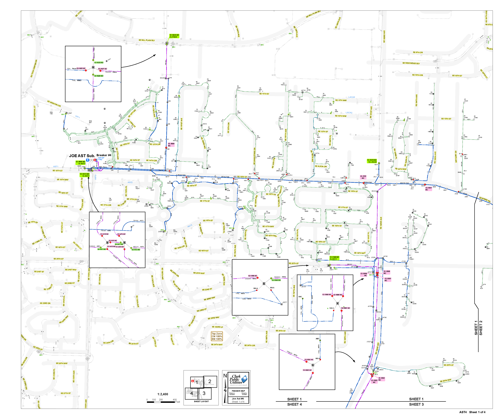
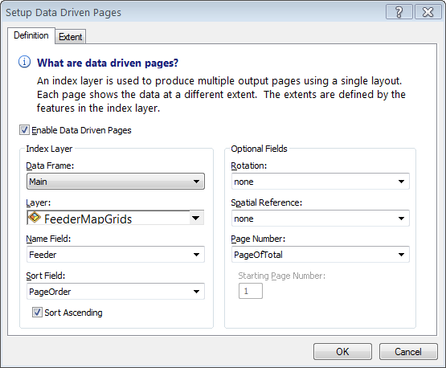
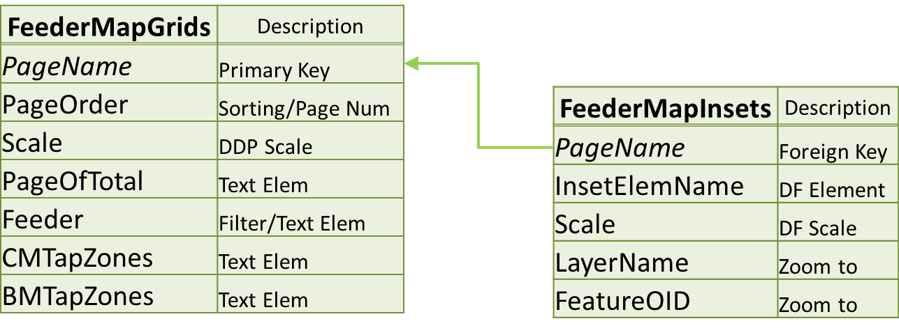
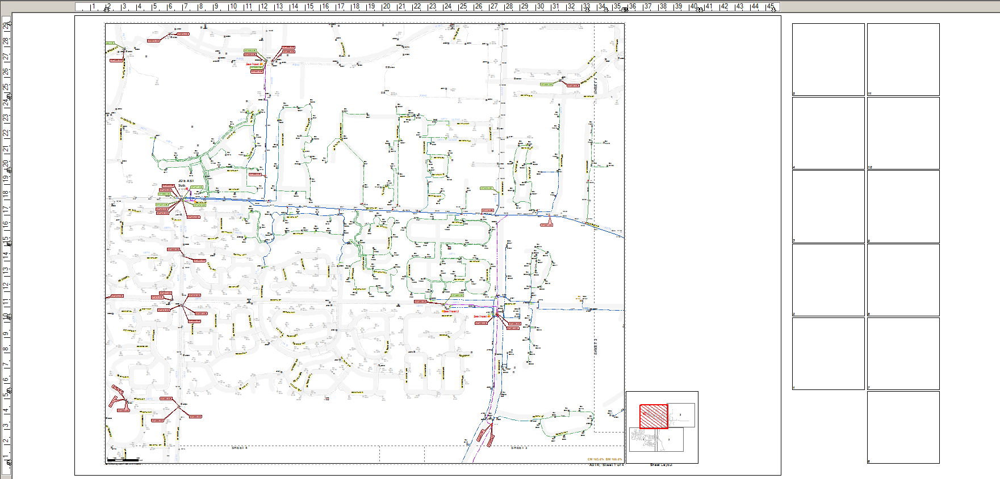
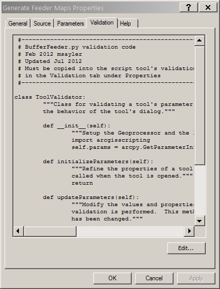

#Follow along: http://mattsayler.github.io/Automating_Feeder_Maps_Presentation

#_Automating_ Feeder Maps Using _Data Driven Pages_ and _Arcpy_

OR


Matt Sayler
_Clark Public Utilities_

#_Obligatory_ Organization _Stats_ Slide

Public Utility District

Electric and Water

~185,000 Electric Meters

~400 Employees

#Clark GIS System

ArcGIS 10.0 SP4

ArcFM 10.0 SP2

#Where Things _Started_

_Dedicated_ full-time employee

_~450_ pages of _individually customized_ MXD files

Custom _layouts_ with _selection-set_ layers

Custom _jpegs_ for inset details (_~300_ images)

Custom _'best-fit'_ grid layout for _each_ feeder

#Example _Old_ Feeder Map



#Pros:

Highly _specific_ symbology

Covers _edge-case_ maps very well

Fits _Dispatch's_ specific _needs_ very well

#Cons:

Management _nightmare_ for GIS Dept.

_Turn-around_ time commonly measured in _days_ per page

_Complex_ process to _add_ new pages

#Then...

Dedicated employee _retires_

Position _left vacant_

_Same_ work, _fewer_ resources

#Option One

Continue with the _existing_ process

(GIS staff _mutinies_)

#Option Two

Go to a _standardized_, county-wide map grid w/_simplified_ symbology

(Dispatch staff _mutinies_)

#Option Three

Standarize map _elements_ and leverage new _Data Driven Pages_ functionality

(Some _initial_ grumbling, but _no mutinies!_)

Bingo

#_What_ are [Data Driven Pages](http://resources.arcgis.com/en/help/main/10.2/index.html#//00s90000003m000000)?

_Tools_ for creating _mapbooks_ using _feature classes_ 

(basically)

#_What_ is [arcpy](http://resources.arcgis.com/en/help/main/10.2/index.html#//000v000000v7000000)?

Esri [python](https://www.python.org/) library for _geoprocessing_ and _other_ tasks

#Project Goals

Retain _80-90%_ of original maps' features

Remain _flexible_

Greatly _reduce_ production time

#Example _New_ Feeder Map


#How does it work?

Data Driven Pages drive the _map_ using our _custom grids_



_Grid_ feature class' attributes _drive_ the dynamic content

A _point_ feature class stores info for _detail insets_



MXD layout:



#Process' Steps 

For Each _Feeder_ Selected:

Empty _PDF_ generated

_Symbology_ set up via _definition queries_

For Each _Page_:

Map _text elements_ updated

_Inset elements_ moved onto layout (as needed)

(_Zoom_ to specified _feature & scale_)

Temp _PDF_ for _page_ created

Temp _page_ added to _empty PDF_

#Pros:

_ONE_ mxd to manage!

Can produce _several_ pages a day

_Standardized_ map layout

#Cons:

_Limited_ number of _insets_ per page

Can be _difficult_ to make _well laid-out_ insets

_Non-network_ features _can't_ easily be symbolized by _feeder_

(selection set layers formerly)

_Extra_ paper usage

#Another _Cool_ Feature Implemented

_Dynamically generated_ feeder picklist!


_Unique value list_ derived from a feature class

Achieved through modifying the script's _validation_ code



```python
def updateParameters(self):
  FC = r"<path to breakers feature class>"
  Col = "FeederID"
  self.params[0].filter.list = [
    str(val) for val in sorted(
      set(
        row.getValue(Col) for row in arcpy.SearchCursor(FC, None, None, Col)
      )
    )
  ]    
  return
```

#Questions?

_Thank you!_

* [msayler@clarkpud.com](mailto:msayler@clarkpud.com)
* [@mattsayler](https://www.twitter.com/mattsayler)
* [github.com/mattsayler](https://www.github.com/mattsayler)
